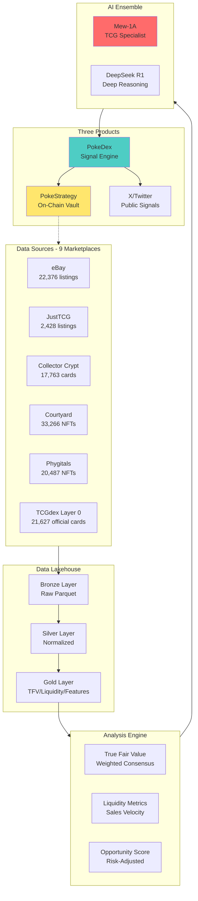
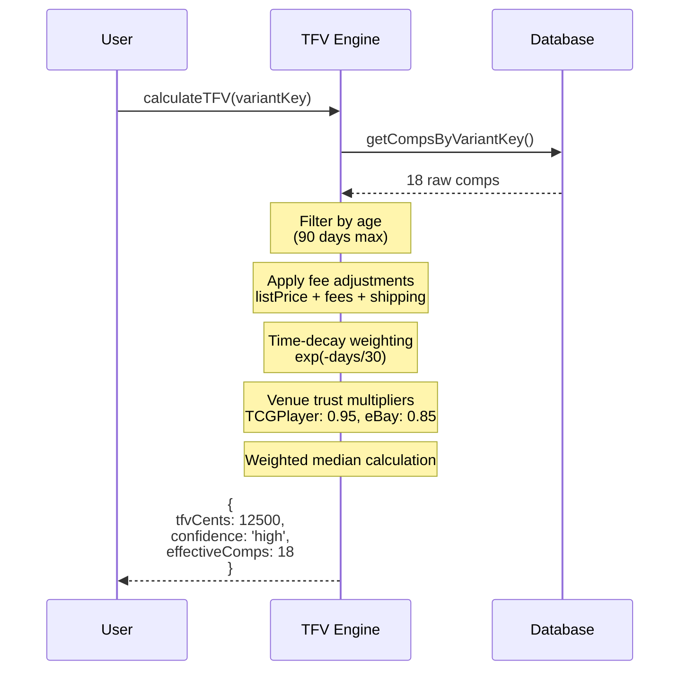
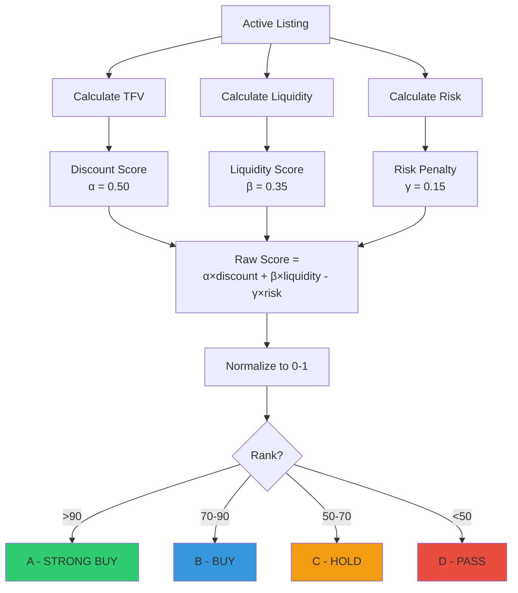
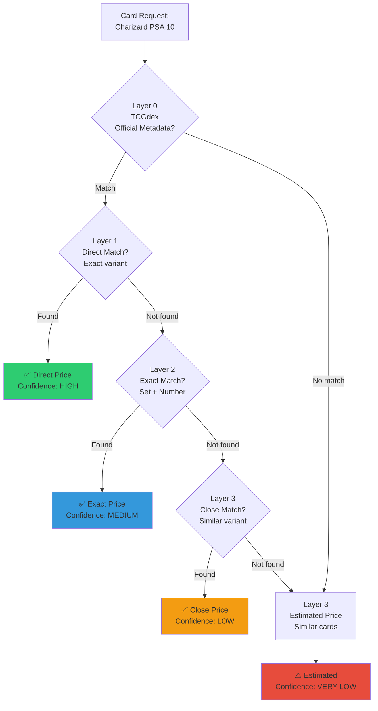

# README Diagram Enhancement Plan

## 🎯 Goal
Add visual diagrams to make the README more accessible and easier to understand for investors, developers, and collectors.

## 📊 Recommended Diagrams

### 1. **System Overview Diagram** (HIGH PRIORITY)
**Location**: After "Three Core Products" section (line ~52)

**Purpose**: Show the complete PokeDAO ecosystem at a glance

**Diagram Type**: Mermaid flowchart

**Content**:


**Why Here**: Gives readers immediate visual understanding of data flow before diving into details.

---

### 2. **Data Lakehouse Architecture** (HIGH PRIORITY)
**Location**: Replace text in "Data Lakehouse" section (line ~120)

**Purpose**: Visualize Bronze → Silver → Gold transformation

**Diagram Type**: Mermaid flowchart

**Content**:


```mermaid
flowchart LR
    subgraph Input[Raw Sources]
        JSON1[JustTCG JSON]
        JSON2[eBay JSON]
        JSON3[Courtyard JSON]
    end

    subgraph Bronze[Bronze Layer<br/>Content-Addressed Storage]
        B1[SHA256 Hashes]
        B2[Parquet Files]
        B3[Manifest Proofs]
    end

    subgraph Silver[Silver Layer<br/>Canonical Tables]
        S1[Cards<br/>Deduplicated]
        S2[Listings<br/>Normalized]
        S3[Comps<br/>Fee-Adjusted]
    end

    subgraph Gold[Gold Layer<br/>Features & Aggregates]
        G1[TFV per Variant]
        G2[Liquidity Metrics]
        G3[Opportunity Scores]
    end

    Input --> Bronze
    Bronze --> Silver
    Silver --> Gold
    Gold --> DB[(PostgreSQL<br/>98,759 cards)]

    style Bronze fill:#cd7f32
    style Silver fill:#c0c0c0
    style Gold fill:#ffd700
```

**Why Here**: Makes the medallion architecture immediately clear.

---

### 3. **TFV Calculation Flow** (MEDIUM PRIORITY)
**Location**: In "How It Works: The TFV Engine" section (line ~150)

**Purpose**: Show how TFV transforms raw comps into true fair value

**Diagram Type**: Mermaid sequence diagram

**Content**:


**Why Here**: Technical readers can see the exact computation flow.

---

### 4. **Real-Time Signal Pipeline** (HIGH PRIORITY - NEW)
**Location**: New section after "Current Architecture" (to be added per README_UPDATES.md)

**Purpose**: Show live signal detection architecture

**Diagram Type**: Mermaid flowchart (already created in REAL_TIME_ARCHITECTURE.md)

**Content**: Use the diagram from `docs/REAL_TIME_ARCHITECTURE.md`

**Why Here**: Critical for understanding the evolution from batch to real-time.

---

### 5. **Opportunity Scoring Formula** (MEDIUM PRIORITY)
**Location**: In "Opportunity Scoring" section (needs to be found)

**Purpose**: Visualize the composite scoring formula

**Diagram Type**: Mermaid flowchart

**Content**:


**Why Here**: Makes the scoring methodology transparent and understandable.

---

### 6. **Multi-Layer Pricing Strategy** (MEDIUM PRIORITY)
**Location**: Near the TFV section or in architecture overview

**Purpose**: Show the 4-layer consensus pricing waterfall

**Diagram Type**: Mermaid flowchart

**Content**:


**Why Here**: Explains the pricing waterfall strategy clearly.

---

### 7. **Package Dependency Graph** (LOW PRIORITY)
**Location**: After "Packages" section

**Purpose**: Show how packages depend on each other

**Diagram Type**: Mermaid graph

**Content**:
```mermaid
graph TD
    core[@pokedao/core<br/>Types & Utils]
    shared[@pokedao/shared<br/>Logger, Config]
    storage[@pokedao/storage<br/>Database]
    adapters[@pokedao/adapters<br/>API Clients]
    analysis[@pokedao/analysis<br/>TFV, Liquidity]
    streams[@pokedao/streams<br/>Real-time]

    analysis --> core
    analysis --> storage
    storage --> core
    adapters --> core
    adapters --> shared
    streams --> core
    streams --> shared

    api[API Service] --> analysis
    api --> storage
    api --> adapters

    pokedex[PokeDex App] --> analysis
    pokedex --> streams

    mew1a[Mew-1A] --> core

    style core fill:#4ecdc4
    style analysis fill:#ff6b6b
    style streams fill:#ffe66d
```

**Why Here**: Helps developers understand the codebase structure.

---

## 🎨 Diagram Standards

### Style Guidelines
1. **Color Coding**:
   - 🟢 Green (#2ecc71): Completed/Good/High confidence
   - 🔵 Blue (#3498db): In progress/Medium confidence
   - 🟡 Yellow (#f39c12): Warning/Low confidence
   - 🔴 Red (#e74c3c): Error/Very low confidence
   - 🔵 Teal (#4ecdc4): Core packages
   - 🔴 Coral (#ff6b6b): Analysis/ML
   - 🟡 Yellow (#ffe66d): Real-time/External

2. **Size**: Keep diagrams readable on GitHub (max ~800px width)

3. **Complexity**: Each diagram should explain ONE concept clearly

4. **Labels**: Use short, descriptive labels with metrics where relevant

## 📋 Implementation Checklist

### Phase 1: Critical Diagrams (Do First)
- [ ] 1. System Overview (after "Three Core Products")
- [ ] 2. Data Lakehouse Architecture (replace text diagram)
- [ ] 4. Real-Time Signal Pipeline (new section - use existing from REAL_TIME_ARCHITECTURE.md)

### Phase 2: Technical Deep-Dives (Next)
- [ ] 3. TFV Calculation Flow
- [ ] 5. Opportunity Scoring Formula
- [ ] 6. Multi-Layer Pricing Strategy

### Phase 3: Developer Tools (Later)
- [ ] 7. Package Dependency Graph

## 🚀 Next Steps

1. **Create diagrams** in order of priority
2. **Insert into README** at specified locations
3. **Test rendering** on GitHub
4. **Get feedback** from users
5. **Iterate** based on clarity

## 📏 Success Metrics

- **Clarity**: Non-technical users understand the system flow
- **Completeness**: Each major concept has a visual representation
- **Consistency**: Diagrams follow the same style and color scheme
- **Engagement**: README gets more stars/attention after diagrams

---

**Total Diagrams**: 7 (3 high priority, 3 medium, 1 low)

**Estimated Time**: 2-3 hours to create all diagrams

**Impact**: Makes README 10x more accessible to investors and developers
