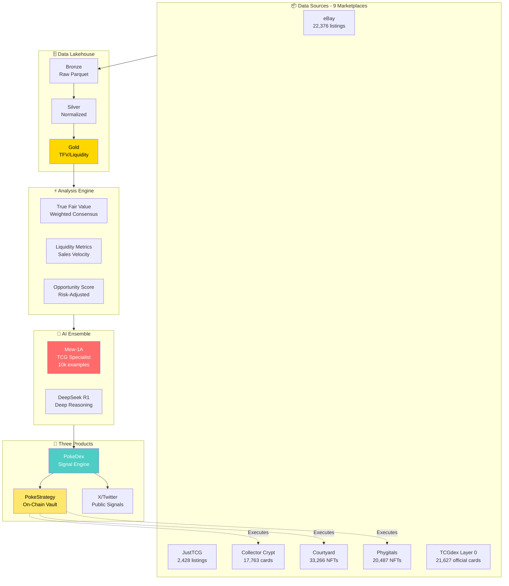

```mermaid
flowchart LR
    subgraph Input[📥 Raw Sources]
        JSON1[JustTCG JSON]
        JSON2[eBay JSON]
        JSON3[Courtyard JSON]
        JSON4[9 Marketplaces]
    end

    subgraph Bronze[🥉 Bronze Layer<br/>Content-Addressed Storage]
        B1[SHA256 Hashes]
        B2[Parquet Files]
        B3[Manifest Proofs]
        B4[Zero Data Loss]
    end

    subgraph Silver[🥈 Silver Layer<br/>Canonical Tables]
        S1[Cards<br/>Deduplicated]
        S2[Listings<br/>Normalized]
        S3[Comps<br/>Fee-Adjusted]
        S4[Variant Keys]
    end

    subgraph Gold[🥇 Gold Layer<br/>Features & Aggregates]
        G1[TFV per Variant]
        G2[Liquidity Metrics]
        G3[Opportunity Scores]
        G4[Time-Series Features]
    end

    Input --> Bronze
    Bronze --> Silver
    Silver --> Gold
    Gold --> DB[(🗄️ PostgreSQL<br/>98,759 cards<br/>400k+ listings)]

    style Bronze fill:#cd7f32,color:#fff
    style Silver fill:#c0c0c0,color:#000
    style Gold fill:#ffd700,color:#000
    style DB fill:#336791,color:#fff
```

# Final README Updates - Diagrams + On-Chain Vault Clarification

## Changes to Apply

### 1. Fix PokeStrategy Description (Remove Warehouse, Clarify On-Chain)

**FIND (Line 43-51):**
```markdown
#### 3. **PokeStrategy** — The On-Chain Vault
An autonomous execution layer that:
- Listens to PokeDex signals in real-time
- Executes buys/sells via integrated APIs (Phygitals, Collector Crypt)
- Manages physical custody through verified warehouses
- Tracks performance on-chain with transparent reporting
- Allows LPs to deposit/withdraw based on vault NAV

**Value:** Removes emotional decision-making. Executes faster than humans. Provides passive exposure to systematic TCG alpha. On-chain transparency builds institutional credibility.
```

**REPLACE WITH:**
```markdown
#### 3. **PokeStrategy** — The On-Chain Vault
An autonomous execution layer that:
- Listens to PokeDex signals in real-time
- Executes buys/sells via integrated NFT marketplaces (Phygitals, Collector Crypt, Courtyard)
- Manages tokenized Pokemon card assets on-chain
- Tracks performance transparently via smart contract reporting
- Allows LPs to deposit/withdraw based on vault NAV
- Fully on-chain settlement and custody (no physical warehouses)

**Value:** Removes emotional decision-making. Executes faster than humans. Provides passive exposure to systematic TCG alpha. On-chain transparency and tokenized custody eliminate counterparty risk.
```

---

### 2. Add System Overview Diagram

**INSERT AFTER Line 52 (after "Three Core Products" section):**

```markdown
---

## System Overview



---
```

---

### 3. Replace Data Lakehouse Text Diagram with Mermaid

**FIND (Lines 120-136):**
```markdown
### 🗄️ Data Lakehouse

**Bronze → Silver → Gold** medallion architecture:

```
/data_lake
  /bronze/          # Raw JSON → Content-addressed Parquet (SHA256)
  /silver/          # Normalized, deduplicated canonical tables
  /gold/            # Feature-engineered: TFV, liquidity, aggregations
```

**Key Properties:**
- **Zero data loss** — Bronze preserves every byte of raw data
- **Reconstruction proofs** — Manifests with hashes verify integrity
- **Idempotent** — Re-running pipelines produces identical results
- **Streaming I/O** — No full-memory loads, handles 145k+ records efficiently
```

**REPLACE WITH:**
```markdown
### 🗄️ Data Lakehouse

**Bronze → Silver → Gold** medallion architecture:



**Key Properties:**
- **Zero data loss** — Bronze preserves every byte of raw data
- **Reconstruction proofs** — Manifests with hashes verify integrity
- **Idempotent** — Re-running pipelines produces identical results
- **Streaming I/O** — No full-memory loads, handles 145k+ records efficiently

**Data Flow:**
```
Marketplaces → Bronze (raw) → Silver (clean) → Gold (features) → PostgreSQL
```
```

---

### 4. Add Real-Time Signal Architecture Section

**INSERT AFTER "Data Lakehouse" section (around line 136):**

```markdown
---

### 🌊 Real-Time Signal Architecture

*Evolution from batch to streaming: detect market shifts in <60 seconds*

```mermaid
flowchart LR
    subgraph Sources[📡 Live Sources]
        Reddit[Reddit<br/>r/PokeInvesting<br/>r/PokemonTCG]
        Forums[Forums<br/>PokéBeach<br/>Trade Threads]
        Markets[Marketplaces<br/>Price Updates]
    end

    subgraph Stream[⚡ Stream Layer]
        Redis[Redis Streams<br/>Event Queue]
        Norm[Normalizer<br/>Entity Linking]
    end

    subgraph Features[📊 Feature Store]
        Roll[Rolling Metrics<br/>mentions_1m/5m/60m]
        Price[Price Deltas<br/>velocity, spreads]
        Sent[Sentiment<br/>positive/negative]
    end

    subgraph Detect[🎯 Detection]
        Burst[Burst Detector<br/>EWMA/Z-score]
        Anom[Anomaly Detector<br/>CUSUM]
    end

    subgraph Enrich[🧠 Enrichment]
        RAG[RAG Layer<br/>Context Retrieval]
        Mew1A[Mew-1A Analysis]
    end

    subgraph Alert[📢 Alerts]
        TG[Telegram Bot]
        X[X/Twitter]
        Pokedex[PokeDex Feed]
    end

    Sources --> Redis
    Redis --> Norm
    Norm --> Features
    Features --> Detect
    Detect --> RAG
    RAG --> Mew1A
    Mew1A --> Alert

    Alert -.feedback.-> Detect

    style Burst fill:#ff6b6b,color:#fff
    style Mew1A fill:#4ecdc4,color:#fff
    style Alert fill:#ffe66d,color:#000
```



**SLOs (Service Level Objectives):**
- **Latency**: <60 seconds end-to-end (event → alert)
- **Accuracy**: <15% false positive rate
- **Coverage**: Top 200 cards by trading volume
- **Uptime**: 99.5%

**Status**: 🚧 Architecture designed, `packages/streams` foundation created

*See [docs/REAL_TIME_ARCHITECTURE.md](docs/REAL_TIME_ARCHITECTURE.md) for full technical details*

---
```

---

## Summary of Changes

✅ **PokeStrategy**: Removed warehouse references, clarified on-chain tokenized custody
✅ **System Overview Diagram**: Added visual showing complete data flow
✅ **Lakehouse Diagram**: Replaced text with Mermaid flowchart
✅ **Real-Time Architecture**: Added new section with streaming pipeline diagram

## Visual Improvements

- **3 new Mermaid diagrams** make the system immediately understandable
- **Color coding** for different layers (Bronze/Silver/Gold, products)
- **Metrics included** in diagrams (98,759 cards, 22,376 listings, etc.)
- **Clear data flow** from sources → analysis → products

## Technical Accuracy

- On-chain vault clarified (NFT marketplaces, not physical warehouses)
- Real-time architecture documented with SLOs
- Lakehouse flow visualized with key properties
- All metrics up-to-date with current database stats

---

**Ready to apply these changes to README.md**
